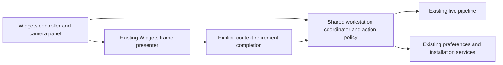

# QML migration: shared workstation policy

Date: 2026-09-13

Checkpoint 2 of the [QML Stage One plan](../../superpowers/plans/2026-09-13-qml-stage-one.md) continues from foundation commit `1df5d06` in `.worktrees/qml-foundation`, branch `codex/qml-foundation`. The QML executable remains the interface preview; this checkpoint changes the C++ seam used by the Widgets workstation. It does not complete the renderer experiment or integrate live QML frames.

## Shared implementation

`lumora_presentation` now owns `WorkstationCoordinator`, `WorkstationState`, `CameraActionPolicy`, `ProcessingControlsModel`, camera draft normalization, viewport math, display modes and workstation status values. It depends on the existing application/core/camera/configuration modules. Configuration brings Qt Core; the presentation target and its tests do not require Widgets, QML or Quick.

The shared coordinator owns source/session/revision checks, saved-profile reconciliation, startup continuations, priority cancellation, processing submission/completion and acknowledged persistence. It creates no widgets, timers or renderer. The Widgets controller retains signal wiring, its polling timer, labels, processing panel and concrete frame presenter. Small `lumora::ui` compatibility headers alias the relocated types; there is one implementation of each model.

`CameraActionPolicy` calculates shared availability for the panel and direct C++ command admission. A disabled button is not the enforcement boundary. Selection, current readback, applied and confirmed revisions, installation binding and context binding remain authoritative facts. Button visibility is separate from cancellation eligibility: Stop may cancel an idle pending Resume, and Disconnect may cancel discovery before the camera snapshot changes.

The existing processing model is relocated without behavioral changes. Its draft/pending/acknowledged state, 30 Hz drag coalescing, exact Release submission and replacement-session fencing remain intact. Startup, preset and installation services retain their codecs and authority; user schema 5, machine schema 2 and capability fingerprint 2 are unchanged.

## Context ownership and continuation

A new source produces a C++ `ContextHandoff` with a monotonic handoff ID and candidate context. The coordinator retains context ownership while the renderer retires its previous source. Polling alone never acknowledges the candidate. The adapter completes the exact current handoff only after releasing old rendering owners and binding the candidate; stale and duplicate completions are rejected. Start stays unavailable until the pipeline reports the current context bound.

Widgets completes this contract synchronously after `FramePresenter::resetSource` clears its previous viewport and bundle owners. A future Quick adapter must prove asynchronous retirement before calling the same completion. Shutdown likewise separates backend joining/final confirmed-state capture from renderer retirement and final context release.

An explicitly authorized saved-settings Resume can wait for delayed binding after confirmation. The coordinator revalidates source, generation, revision, readback and installation binding before continuing to Start. Priority Stop/Disconnect, selection changes or invalidated facts cancel that continuation. Ordinary startup does not start streaming automatically.

## Verification scope

Full Linux Debug and Release builds and suites pass, including the QML preview smoke. The standalone presentation tests link neither Widgets nor Quick. Exact source hashes, local logs, review reports and captures are retained under `out/qa/qml-policy/`; `verification.json` identifies the accepted evidence and `verified-source.json` records all 330 source/build/test file hashes. The foundation's dependency record describes the matching official Qt 6.11.1 Linux SDK used by these builds; both application build configurations use its release Qt libraries.

| Final check | Debug | Release |
|---|---|---|
| Full build with QML enabled | Pass | Pass |
| CTest, excluding `hardware\|desktop` labels | 72/72 groups, 61.83 s | 72/72 groups, 38.93 s |
| Native XCB/Xvfb window and layout tests | 8/8 cases | 8/8 cases |
| Native XCB/Xvfb affected simulator workflows | 6/6 cases | 6/6 cases |
| Standalone presentation executable linkage | No Widgets, GUI, Quick or QML libraries | No Widgets, GUI, Quick or QML libraries |

The Release Widgets application also builds with `LUMORA_BUILD_QML_UI=OFF` against the original Widgets dependency prefix. Accepted native captures are in `captures-debug-settled/` and `captures-release-settled/`: confirmed and expanded review/warning states at 900×600 and 1280×800, paused/stale at 900×600, and absent-fixed-camera dialogs at 560×560 and 720×640. All seven capture pairs are byte-identical across Debug and Release. These virtual-display checks establish Linux widget behavior and layout, not physical graphics or Windows validation.

Existing Widgets camera, processing, installation and lifecycle integration tests remain regression coverage through the new binder. Shared tests instantiate the production coordinator with the real simulator pipeline and preferences service, without Widgets/Quick. Controlled camera gates and delayed adapter completion exercise asynchronous boundaries without replacing the application policy with a test implementation.

## Review and verification corrections

Independent scoped model/policy review and final checkpoint specification/quality review found no remaining required fixes. Shared admission now rejects an absent desired request instead of inferring intent from backend readback; a negative test demonstrated the earlier behavior before the fix. Readback text remains displayable without granting command authority.

The existing 100-cycle fixture issued Connect both at the end of one cycle and at the beginning of the next. It now omits only that redundant command after the first iteration, preserving all 100 cycles and their frame/pool retirement assertions under the shared disconnected-only admission rule. This deterministic fixture correction is separate from the previously recorded lifecycle intermittency.

Native visual QA exposed a first-pass layout capture taken before pending Qt layout events had settled. Vertical minimum-size assertions reproduced the clipping, and the test fixture now waits for valid visible-control geometry before inspecting and capturing it. The confirmed 900×600 settled capture matches a retained verified M9 artifact; that comparison is not a fresh baseline run. No production layout or styling was changed.

Two nonblocking review follow-ups remain for the next relevant seam change: consolidate repeated successful-request predicates, and deterministically force backend replacement between handoff validation and acknowledgement when Checkpoint 3 introduces its controlled asynchronous sink.

## Remaining work

Checkpoint 3 must establish bounded ticketed rendering, exact bundle/receipt identity, Pause ordering, freshness, rendering-owner retirement and measured upload/storage costs. Checkpoint 4 then connects the QML simulator workstation through this shared policy. The current image renderer, frame pools, acquisition workers and processing algorithms are unchanged by this extraction.

Native Windows build/UI/DPI checks, physical graphics/hardware evidence, production packaging, existing lifecycle intermittency, the 2048 processing performance shortfall and formal milestone acceptance remain separate open work. No merge, push or hosted CI is claimed here.
