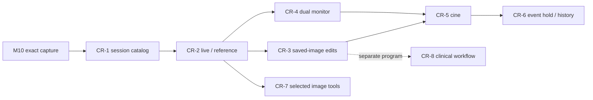

# C-arm Workstation Delivery Plan

> **For agentic workers:** REQUIRED SUB-SKILL: Use superpowers:subagent-driven-development (recommended) or superpowers:executing-plans to implement this plan task-by-task. Steps use checkbox (`- [ ]`) syntax for tracking.

**Goal:** Deliver a familiar Live/Reference workstation in testable increments, then add scene review and device-specific automation without confusing planned work with implemented features.

**Architecture:** Retain one acquisition pipeline. Add transactional capture, a persistent non-patient session catalog, independently owned reference presentation/processing, and later a separate bounded recording path. Native Qt Quick presents one- or two-monitor layouts over shared C++ services.

**Tech Stack:** Existing C++20, Qt Quick/QML, OpenCV and CMake/CTest; no new database, codec or networking dependency is selected by this roadmap.

**Spec:** [C-arm workstation design](../specs/2026-09-17-carm-workstation-design.md).

**Status:** Requested planning update, 2026-09-17. All new delivery checkboxes are open. Planning is authorized; no implementation, milestone acceptance, clinical approval or execution-order exception is recorded by this document.

## Global Constraints

- M1–M14 retain their current execution and release gates. New extension work must record its entry conditions at implementation kickoff.
- Evaluation work uses synthetic sequences, phantoms and test objects. A test session is not a patient examination.
- Capture Live always snapshots the exact completed bundle visible in Live, including when paused.
- Review decoded images, processing scratch, renderer textures, thumbnails, recorder buffers and live pools have separate measured limits.
- Live processing remains enabled and independent of Reference edits. Give Live resource priority through bounded admission and review throttling; separate workers alone do not guarantee performance isolation.
- Pause Live and reference playback do not stop recording.
- Radiation state is Unknown unless supported by a validated device signal.
- Recording controls ship only with CR-5 acceptance, preserving the present no-Record rule until then.
- Keep Linux/GCC and Windows/MSVC Debug/Release verification, native UI/DPI checks and physical acceptance evidence distinct.
- Use existing processing, preset, source-confirmation, installation-orientation and configuration-persistence services. Do not implement competing copies.

## 1. Execution order and review checkpoints

The CR identifiers are extension phases, not replacement milestone numbers. M10 still owns snapshot encoding and transactional publication. CR-1's catalog follows that foundation. The detailed plans define dependencies; they do not silently waive M4/M5/M6/M8 or later gates. At implementation kickoff, record the exact source baseline, completed prerequisites and any owner-selected scoped development continuation, as the repository already does for simulator work.

CR-4 layout preparation may proceed alongside CR-3 after the two presentation contexts are stable; final dual-display acceptance includes CR-3 draft preservation and therefore follows its integration. CR-5 backend preparation may proceed after CR-3; user-visible cine delivery follows CR-4 layout/state acceptance, matching the UI plan. Input-only capture pedal mapping in CR-6 may be delivered after CR-2; device-event hold/history waits for CR-5 and the hardware contract. CR-7 items are selected individually from measured needs. CR-8 is a separate future program, not a dependency for evaluation image review.

| Phase | User-visible result | Detailed owner / exit condition |
|---|---|---|
| CR-1 | Capture Live saves a traceable still and shows it in a persistent test session | [Capture/review plan](2026-09-17-carm-capture-review.md), [M10](2026-04-25-m10-snapshot-capture.md); exact round trips, durable result and failure recovery |
| CR-2 | Live keeps updating while an earlier saved image is selected or locked | Capture/review plan + [UI plan](2026-09-17-carm-workstation-ui.md); independent content/view state and no live resource starvation |
| CR-3 | Edit a saved image and save a derived copy without changing Live | Capture/review plan + UI plan; historical recipe correctness, draft protection and lineage |
| CR-4 | Polished single-screen layout and separately assigned Live/Reference monitors | UI plan; supported sizes, keyboard/touch, DPI/hotplug and native Windows verification |
| CR-5 | Record a bounded scene, replay/step/scrub and export a chosen still | Section 4; documented loss policy, storage benchmark and playback identity |
| CR-6 | Optional capture pedal, validated automatic hold and last-run recall | Section 5; source/event contract and fault behavior verified |
| CR-7 | Selected masks, image tools or source-appropriate correction | Section 6; each item has its own specification and numerical/UX evidence |
| CR-8 | Clinical patient/study workflow and interoperability | Section 7; separate scope, conformance and clinical release gates |

## 2. Files and subsystem responsibilities

| Area | Existing seam / proposed responsibility |
|---|---|
| Exact-frame capture | Existing planned `src/capture`; M10 service/encoder/store and immutable frame provenance |
| Session library | Proposed `src/capture` session persistence/catalog; `src/review` reader and bounded thumbnail cache; manifests authoritative, index recoverable |
| Reference processing | Proposed review session/service using the existing processing engine with independent workspace and selected-image revision |
| Application coordination | Existing `src/application`, `src/presentation` and QML composition; target-aware commands and source/session lifetimes |
| View composition | Existing `src/qml/QuickImageItem`, `ViewerSurface`, `LayoutAdapter` and new Live/Reference components from the UI plan |
| Scene storage | Proposed `src/recording`, independent source-copy admission, background writer and playback reader |
| Event/input integration | Proposed `src/input` for UI actions; a separate device-event port after protocol discovery |
| Optional tools | Separate specifications that extend processing or review services without embedding pixel logic in QML |

Proposed paths are implementation destinations, not claims that files exist. The focused plans own their exact type/API names; use the shared terms and action semantics from the design when integrating them.

## 3. First delivery: capture through polished reference review

- [ ] Record implementation baseline and prerequisite/gate status before starting CR-1.
- [ ] Execute the capture/review plan through exact M10 save and frame-bound provenance. Complete meaningful negative tests before adding a gallery.
- [ ] Add durable test-session association as the CR-1 extension; reopening must recover complete saved artifacts without requiring the camera.
- [ ] Execute the UI plan's capture/dual-context tasks alongside CR-2. Capture Live remains visibly target-specific.
- [ ] Deliver CR-3 review edits, recipe isolation and Save copy before presenting the inspector as fully functional.
- [ ] Complete CR-4 layout, monitor, keyboard/touch and state verification. No default layout may conceal a source fault or change what Capture Live targets.
- [ ] Run the operator task evaluation defined by the design; resolve wrong-target actions and false save/live impressions before acceptance.
- [ ] Update progress and requirements traceability with actual results and exact source identity, leaving unrelated open gates intact.

**Review checkpoint:** Demonstrate a synthetic moving marker in Live; capture it; lock Reference; capture a second image; adjust the first saved image; save a derived copy; restart and reopen; disconnect the source and then a display. Each visible image and status must remain attributable to the correct source/session/capture.

## 4. CR-5 — bounded scene capture and playback

### Task 5.1: Specify the initial recording profile

**Create:** `docs/superpowers/specs/<implementation-date>-carm-cine-design.md` and its focused implementation plan. Proposed production files are `src/recording/include/lumora/recording/SceneTypes.hpp`, `RecordingAdmission.hpp`, `SceneStore.hpp`, `SceneReader.hpp` and corresponding `.cpp` files; actual names are fixed in that focused plan.

- [ ] Benchmark the admitted source formats, selected workstation and storage without UI recording controls.
- [ ] Carry forward the owner's 2026-09-17 decision: preserve original incoming frames plus processing settings. Original means pixels received by Lumora, including any upstream processing; enhanced-display recording is not the initial deliverable. Keep Live enhancement active throughout recording.
- [ ] Select a versioned directory manifest plus lossless per-frame PNG as the first evaluation sequence representation, reusing the validated encoder boundary. Capture native source pixels and source timestamps; do not promise encoded video export or uniform playback spacing.
- [ ] Start profile validation with proposed ceilings of 10 seconds, 300 acquired frames, an eight-frame writer queue, a 128 MiB recording-copy budget and 1 GiB per run. These are admission ceilings to validate, not promised durations/performance. Compute the shorter usable limit from actual layout/stride and worst-case encoded size; reject profiles that cannot fit a complete frame. The UI shows the admitted limit before Start recording.
- [ ] Define accounting for raw, processing-recipe metadata, queue copies, decoding, prefetch and display separately. Never borrow an unbounded number of live-pool leases.
- [ ] Select the completeness policy: every accepted recording frame either persists or has an explicit gap/error entry. Queue full skips recording only and increments the run's dropped-frame count; it cannot stall acquisition. A source fault or storage failure ends the run as incomplete.
- [ ] Record this measured profile and limits as an execution prerequisite before implementation of production controls.

### Task 5.2: Source-copy admission and storage

**Modify:** source handoff at `src/application/src/AcquisitionWorker.cpp` through a recording port; leave the live latest-value contract unchanged. **Create:** recording unit tests and integration tests with fake storage and known frame/timestamp sequences.

- [ ] Write failing tests for ordered IDs, intentional acquisition gaps, queue full, source switch, writer failure, cancellation and bounded copy memory.
- [ ] Implement a nonblocking recording admission branch before the latest-frame processing slot. Copy into recorder-owned storage and release the acquisition frame promptly; never record by polling the presenter.
- [ ] Persist frame-bound format and acquisition metadata, initial recipe and subsequent recipe revisions. A raw recording does not falsely claim to match every displayed enhanced frame.
- [ ] Publish only complete frames. Finalize a complete scene atomically; recovery of an interrupted run yields a clearly labelled recovered/incomplete scene with only verified frames. Use M10's path-containment, Unicode and publication-uncertainty contract: after final rename may have occurred, reconcile that same scene identity rather than aborting it or creating a duplicate run.
- [ ] Reject source reconfiguration and capture-session changes while recording; require explicit Stop recording. Keep past-session browsing available without redirecting the recording destination, subject to the normal dirty-draft and resource guards. A source fault terminates the run with the known reason, while preserving completed material.
- [ ] Run deterministic failure tests and concurrent live/capture/recording load; report queue high-water and frame-drop counts separately.

### Task 5.3: Reference playback and frame extraction

**Create:** scene reader/playback controller and tests under `src/review` / `tests/unit/review`; QML scene controls owned by the UI plan.

- [ ] Write failing tests that variable timestamps, dropped frames and seeks map to the correct source-frame identity.
- [ ] Implement bounded decode/prefetch with cancellation on scene changes; latest requested seek wins. Playback failures retain truthful last-valid-image state and do not stop Live.
- [ ] Provide Play/Pause scene, frame step, timestamp-aware scrub, speed selection, loop range and previous/next scene. Playback controls act only on Reference.
- [ ] Expose **Save selected frame** in Reference and extract the acknowledged recorded Original through bounded capture admission with its timestamp, scene ID, source-frame lineage and parent session. Freeze that identity at admission while allowing later playback/seek to continue. The saved still does not replace the current scene or alter Live. Enhanced copies use a separately identified review recipe. Verify exact pixels and lineage under delayed encoding, busy, failure and indeterminate publication; never substitute Live or a later decoded frame.
- [ ] Show saved scene duration, frame count and gaps; never present a nominal FPS as proof every frame was retained.
- [ ] Verify pause-Live-during-recording, review-during-recording, storage exhaustion and shutdown/recovery scenarios before exposing Record UI.

**Exit:** Tested admitted profiles, usable playback, exact selected-frame extraction, no unbounded memory growth, and no acquisition stall under simulated slow/full storage. Record UI remains absent from previous releases.

## 5. CR-6 — capture inputs, hold and retrospective history

### Task 6.1: Input-only keyboard / foot-switch mapping

- [ ] Specify the target input device class and observed events; start with keyboard-equivalent capture input if available. Do not assume the C-arm radiation pedal is available as a computer input.
- [ ] Map explicit actions `Capture Live`, `Pause Live`, `Resume Live`, and optional `Lock reference`; provide visible assignment and a synthetic test mode.
- [ ] Add tests for press/release, repeat suppression, duplicate events, disconnect, input focus and application shutdown. One press cannot create an unbounded capture burst.
- [ ] Reuse capture/hold command policies and report busy/failure outcomes. No equipment actuation or generator control is included.

### Task 6.2: Device-event contract and automatic hold

- [ ] Record manufacturer/model, signal/protocol, event sequence IDs, start/end semantics, clock relationship, timing uncertainty and loss/reconnect behavior.
- [ ] Specify a read-only event-source port and fixture sequences, including delayed/duplicate/missing/out-of-order events. Device radiation indication remains independent of Lumora's display state.
- [ ] Define which qualifying complete frame is held for an event end, how source/event times are aligned, and when the answer is unavailable. Source loss must not be converted into a successful event end.
- [ ] Add opt-in arming, an explicit Held image label with time/age, manual override and Resume Live; optional autosave uses the same exact-frame capture service and deduplicated event identity.
- [ ] Validate on synthetic fixtures before hardware acceptance. Image-based estimation, if selected later, gets a separate spec and an Estimated label.

### Task 6.3: Last-run / retrospective recall

- [ ] Measure and admit a fixed history duration/byte budget independently of CR-5's writer queue. Define wrap, overwrite and source/settings-reset behavior.
- [ ] Expose Save last scene only when a complete eligible history interval exists; show its real duration, gaps and timestamps.
- [ ] Test event boundaries crossing ring wrap, low FPS, short exposure, reconnect, configuration changes, full storage and repeated saves.

**Exit:** Manual actions are reliable without device events; automatic features remain unavailable until their protocol and timing evidence exists. No image-state heuristic becomes a radiation safety indication.

## 6. CR-7 — separate image-tool planning packages

Each item begins with a focused spec and implementation plan, preserving current v1 exclusions until explicitly amended. No placeholder toolbar is added in anticipation.

| Package | Ordered work | Acceptance evidence |
|---|---|---|
| Circular mask / display shutters | Define geometry and coordinate system → preview-only application → reset/persistence → export metadata | Matching mask in Original/Enhanced, stable pan/zoom, untouched Original samples; no physical collimation claim |
| Annotation | Amend evaluation review scope → image-bound text/line/marker model → edit/undo → save derivative metadata | Correct image association, no burned-in loss of Original, visibility/export rules |
| Measurement | Define calibration reference and provenance → pixels-only mode → calibrated distances/angles → validity warnings | Known test-object accuracy; units, magnification and invalidation; no uncalibrated millimetre claims |
| Temporal denoise | Characterize actual noise → choose bounded temporal filter → version pipeline order → implement history/reset → expose conservative control | Moving/static sequences, motion trails, timing and resource measurements; distinct frames only |
| Dark / flat-field calibration | Identify suitable raw source → reference collection → match/invalidate → correction → capture provenance | Camera/format/settings matching, cancellation/recovery and exact/numerical reference checks |
| Subtraction / roadmap | Confirm vascular use case → mask/run model → registration/motion failure behavior → performance/UX specification | Procedure-specific verification; separate clinical gate where applicable |
| Test-session report | Reuse catalog selections → contact-sheet/report layout → technical captions and source links → export | Correct capture/recipe association, readable output, evaluation identity and Original availability |

## 7. CR-8 — future clinical workflow program

This is planned discovery and delivery sequencing, not clinical implementation authorization. It does not change the current prohibition on real patient data.

1. **Product and release definition:** document intended users/procedures, legal manufacturer, target jurisdiction, qualified regulatory input, clinical/usability/risk/cybersecurity obligations and release authority under the existing clinical gate.
2. **Identity and records:** define patient, study, series and instance identity; emergency/unidentified cases; correction/reconciliation and wrong-patient prevention; retention, backup, restore, access roles and audit events. Prototype only with synthetic identities.
3. **Interoperability:** select DICOM SOP classes and conformance statement scope from actual pixel provenance; do not label captured video as native detector data. Specify worklist, storage, transfer confirmation, retry/reconciliation and optional query/retrieve against identified receiving systems. Evaluate library/licensing/security before dependency changes.
4. **Clinical review:** define validated display requirements, calibrated measurements, annotations/reports, export provenance, and dose/exposure metadata only where supplied by a validated source. Missing dose is unavailable, never zero or estimated from image brightness.
5. **Verification and release:** interoperability fixtures and partner-system tests, recovery/data-integrity evidence, human-factors/clinical validation and the separately authorized clinical release gate.

**Deliverables before coding:** amended PRD and architectural specification, traceable requirements/risk controls, data/security model, DICOM conformance plan, test environment, and phased implementation plans. Merely completing CR-1–CR-7 does not satisfy this program.

## 8. Planning verification and handoff

- [ ] At each phase kickoff, confirm actual source APIs and adapt proposed file names before editing code.
- [ ] Check every CARM requirement in the shared design against a task and acceptance criterion.
- [ ] Run focused tests first; then the existing Linux and Windows Debug/Release suites and relevant native scenes. Existing baseline failures must be recorded, not hidden by a pass claim for a subset.
- [ ] Compare concurrent Live performance against the exact same source/workstation/profile baseline; define allowed throughput/latency regression and review-admission thresholds before collecting acceptance results. Measure acquired/processed/displayed/recorded rates, frame age, latency distribution and queue high-water while exercising review edits, still encoding and recording together. Verify throttling/deferred review retains a usable last-complete Reference and never silently changes the Live recipe or source FPS. Do not accept a concurrent profile that exceeds its agreed budget.
- [ ] Preserve failures, source hashes, platform details and operator findings in `docs/architecture/milestones/`.
- [ ] Update the PRD/index/progress/traceability when a phase is actually implemented. Do not pre-check delivery tasks merely because a plan or mockup exists.

The immediate implementation entry point is M10 capture and CR-1 in the [capture/review plan](2026-09-17-carm-capture-review.md); the [UI plan](2026-09-17-carm-workstation-ui.md) supplies the corresponding screens and behavior. Review the shared design and concept before choosing the first implementation slice.
