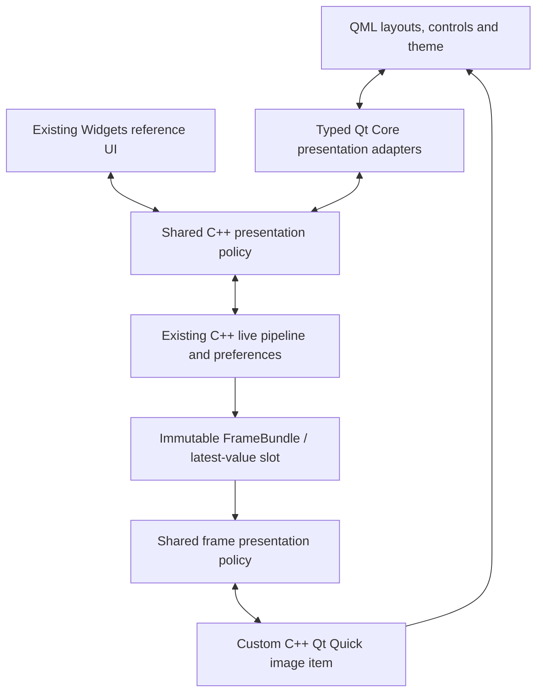

# Qt Quick/QML migration: readiness and proposed design

Date: 13 September 2026

Status: **Selected UI direction; proposed integration design.** [ADR 0001](../../adr/0001-qt-quick-qml-frontend.md) records the owner's choice of Qt Quick/QML. The implementation sequence below remains proposed. No application code, build configuration, or milestone acceptance changes are part of this documentation update.

Original inspection: `cd4c8038195f9f313b0305d0229d4cdae05c8b8d` on `main`. This copy preserves that draft and updates the camera baseline against the completed continuation at `828e39f8cebf8f1e1960d3d71243e015f8ec6752` on `codex/m09-camera-controls`: production source `2be3a85`, test-only successor `ef28052`. The original inspection did not include local Tasks 4C–4E.

## Next-session handoff

Continue from local `main` in `/home/mo/code/Lumora`. The [local integration at `e2de210`](../../architecture/milestones/m09-camera-controls.md#local-main-integration) includes Tasks 4C–4E and this QML handoff; it has not been pushed and has no PR or hosted CI result. The former `codex/m09-camera-controls` branch and `.worktrees/m09-camera-profiles` worktree remain retained with their verification records. Read the [current progress](../../PROGRESS.md#next-session-qt-quickqml) and [Task 4E evidence](../../architecture/milestones/m09-camera-controls.md) before planning the migration.

The first action in the new session is to refine this proposal into a bounded Stage 1 implementation plan, including shared presentation boundaries and a renderer experiment with explicit pass/fail criteria. No QML target, option, application or migration implementation plan exists yet. The theme, exact stage boundaries and proposed target names below remain design choices to validate during that work.

## Decision and readiness

Lumora is ready to **begin** a Qt Quick/QML migration. It is not ready for a drop-in replacement of its current window. The camera, processing, configuration and frame ownership foundations can be reused. The work is concentrated in presentation: shared state and command handling, QML bindings, a Qt Quick image renderer, controls, and their verification.

The original draft assumes mouse and keyboard as the primary input method, with control sizes that can accommodate touch later. Initial acceptance does not claim touchscreen support.

Use a separate, optional QML application during migration. Keep the existing Widgets application available as a behavioral reference. Both frontends should use the same C++ policy implementation; they are alternative application runs, not two simultaneous consumers of one live session.

| Area | Evidence in current source | Migration treatment |
|---|---|---|
| Acquisition and processing | `src/application/include/lumora/application/LivePipeline.hpp` exposes snapshots, commands, completion outcomes and session handles. | Reuse the existing pipeline, workers, simulator and processing algorithms. |
| Frame ownership | `src/core/include/lumora/core/Frame.hpp` and `LatestValueSlot.hpp` provide immutable owned frames and bounded newest-value exchange. | Keep pixels in C++; retain owners across the rendering/upload lifetime. |
| Presets and processing edits | `src/ui/include/lumora/ui/ProcessingControlsModel.hpp` has no QWidget dependency and already tracks draft, pending and acknowledged state. | Reuse the model; add a typed QML adapter and move it into the shared presentation target as needed. |
| Controller | `src/ui/src/WorkstationController.cpp` holds `WorkstationView` and `CameraStartupPanel`, creates `ProcessingPanel`/`QLabel`, and owns startup/persistence continuations. | Extract the nonvisual behavior before binding the QML frontend. |
| Camera controls | Tasks 4C–4E add stopped ROI/format editing, per-camera preferences, installation orientation, compact contextual controls and authoritative capability/readback handling. `CameraStartupPanel.cpp` and `CameraSettingsDialog.cpp` still contain Widgets presentation policy. | Preserve the completed behavior and extract reusable policy as the corresponding QML controls are introduced. |
| Image presentation | `FramePresenter` takes a concrete `WorkstationView`; `ImageViewport` reports completed QWidget painting. | Extract the presentation contract and implement an asynchronous Qt Quick rendering adapter. |
| Viewing geometry | `ViewportTransform.hpp`, `DisplayMode.hpp` and `WorkstationStatus.hpp` already contain reusable values/policies. | Preserve Fit, logical 100%, shared pan/zoom, orientation and status behavior. |
| Build | `cmake/Dependencies.cmake` requires Core/Widgets only; `vcpkg.json` has no `qtdeclarative`. | Add matching QML/Quick dependencies and an opt-in application target. |
| UI verification | Existing renderer tests use QWidget rendering; CTest presets select the minimal platform. | Retain their behavioral coverage and add actual Qt Quick rendering tests. |

The [Task 4E verification record](../../architecture/milestones/m09-camera-controls.md#verification) binds full Linux Debug/Release 68/68 groups and native checks to production `2be3a85`; focused simulator 59/59 and targeted sanitizer 22/22 groups bind to the test-only successor `ef28052`. Those results verify the Widgets baseline, not a QML build or performance result. Existing native Windows, hardware and performance acceptance work remains separate.

## Approaches considered

1. **Separate QML frontend with shared C++ presentation — recommended.** A new window can become coherent from the start, while the old app remains runnable for comparison. The main cost is extracting the state/presentation seams and implementing the image renderer.
2. **Embed QML panels in the Widgets window.** This could replace individual controls sooner, but would retain two UI systems and their focus, layout and styling interactions. `QQuickWidget` also introduces an additional render pass and disables the threaded render loop. This is not the proposed long-term workstation architecture. See [Qt's performance considerations](https://doc.qt.io/qt-6/qquickwidget.html#performance-considerations).
3. **Replace the whole Widgets UI in one change.** This avoids a temporary second executable but combines control migration, rendering, build and behavioral regressions in one large change. It is harder to compare against the existing implementation and is not recommended.

## Proposed architecture

The diagram shows two alternative frontends. Each executable owns its own composition; it must not attach two presenters to the same consuming latest-value slot.

### Shared presentation and typed QML adapters

Introduce a Widgets-independent presentation target, tentatively `lumora_presentation`. Qt Core may be used here; application/core/processing targets must not gain QML, Quick or Widgets dependencies.

Extract startup continuations, pending-command handling, action availability, configuration readback/confirmation, preference acknowledgments and processing-edit coordination from the existing widget owners. Widgets and QML must call the same implementation of these rules. An arbitrary QML method call must still be rejected in C++ when the camera state, session or revision makes it invalid; a disabled button is not the enforcement mechanism.

Carry forward Task 4E's independent mode/value access facts, unavailable/read-only fields, source-tagged repairable drafts and authoritative current readback. Reading or saving configuration never grants Apply/Confirm/Start authority, and failed newer Apply cannot reuse an older confirmation. Reuse user schema 5, machine schema 2 and capability fingerprint 2, including legacy-fingerprint review requirements; a UI migration alone needs no new persistence schema. Keep installation read/write authority, save-versus-activation and priority Stop/Disconnect guards in shared C++ policy.

Provide small typed QObject adapters for camera state/actions, processing edits and viewer state. Use properties with change notifications, typed list models where lists are needed, and a deliberate command surface. Register types with the QML module and inject the application-owned adapter into the root view. Avoid an untyped global dictionary or scattered context properties.

Keep request/session/revision bookkeeping in C++. QML numeric conversion must not become the authority for 64-bit frame IDs or session tokens. Camera and processing numeric editors must preserve the existing precision, range and final-value behavior; do not silently replace real-valued fields with integer-only controls. Preserve drag coalescing and exact release commits in the existing processing model.

QML handles layout, focus, expansion state and user intent. It does not open cameras, run pixel processing, write configuration, confirm requests automatically or own raw frame arrays. Qt documents the supported C++/QML integration model in [QML and C++ integration](https://doc.qt.io/qt-6/qtqml-cppintegration-overview.html).

### Live image rendering

Introduce a C++ Qt Quick image item behind a presentation interface. It consumes the already prepared Gray8 display frames. The native raw/U16 data, window/level mapping and installation orientation remain owned by the existing pipeline. Do not apply orientation or a second tonal adjustment in QML.

Use the public Qt Quick scene-graph texture path as the initial rendering candidate. Confirm supported gray channel handling, padded row strides, image filtering and resource lifetime in the renderer experiment before committing to a texture format. Record any conversion/staging copies and GPU allocations. A texture upload must not be described as zero-copy, and existing CPU allocation evidence does not cover the new renderer.

Do not transport each frame through JavaScript arrays, base64, files or independent Original/Enhanced image URLs. Compare must draw both planes from one validated bundle with one shared viewport transform and one presentation receipt.

The existing synchronous paint callback cannot simply be queued from the Qt Quick rendering thread. The new presentation interface requires a bounded submit/complete protocol. Its implementation design must define and test:

- A C++ ticket containing session generation, source frame identity and presentation revision; mode-only repaints have distinct presentation revisions.
- Bounded candidate, in-flight and completed ownership. The first implementation should serialize presentation submissions while one ticket is in flight, reading the newest available source when ready. Account for retained CPU owners and GPU/staging memory explicitly against the current resource budget.
- A completion receipt tied to the ticket actually used by the visible image item, including the monotonic timestamp captured at the renderer completion boundary. Do not substitute the later time when the GUI processes a queued receipt. Creating a texture, calling `update()`, or animating another control does not count as displaying a new image. Preserve both host-receipt age and elapsed time since a new source frame completed, with the existing `max(500 ms, 3 actual frame periods)` stale deadline; delayed acknowledgment delivery must not renew freshness.
- A defined renderer completion point. For an on-screen QQuickWindow, correlate the item's render ticket with the window's frame presentation submission signal. Qt's `frameSwapped` means queued for presenting, not confirmed physical monitor scan-out. Document this application-level boundary as the Quick equivalent of the current paint-completion measurement.
- Pause ordering relative to a render already in flight. The implementation experiment must define the synchronization point and prove the visible frozen bundle and reported frozen bundle agree before Pause is considered complete. A late queued completion must not silently replace a frozen bundle.
- Rejection of receipts from retired sessions and canceled presentation revisions; reset/shutdown must retire rendering owners before claiming the old session is released.
- Minimize, zero-size/hidden items, window close, scene-graph invalidation/recreation, upload failure and backend initialization failure. None may advance freshness without an image presentation. Failure should retain an explicitly invalidated old image or show an unavailable state with an actionable error.

Renderer synchronization and Pause ordering are the principal feasibility checks in the first integrated milestone. Resolve them before building all settings screens. Qt explains the threading model in [Scene Graph and Rendering](https://doc.qt.io/qt-6/qtquick-visualcanvas-scenegraph.html) and the signal semantics in [QQuickWindow](https://doc.qt.io/qt-6/qquickwindow.html#frameSwapped).

### Visual direction

Use Qt Quick Controls with a consistent customized Basic style, rather than rebuilding standard control interaction from rectangles. Centralize colors, typography, spacing, radii and control sizes in a small Lumora theme. Qt supports this through [customizable control implementations](https://doc.qt.io/qt-6/qtquickcontrols-customize.html).

The initial screen keeps the image dominant, with a compact camera summary, a clear viewing toolbar, a collapsible adjustment sidebar and a concise status strip. Start with a neutral dark palette, one restrained accent color, legible numeric entries, consistent icons and strong keyboard focus indicators. Important states use text and shape as well as color. Keep common controls visible and expand Advanced parameters on demand.

Use modest transitions for panels and control feedback. Frame presentation, live/paused/stale labels, critical errors and command completion indications must update immediately without decorative delays. Do not animate, tint, blur or otherwise restyle the image pixels. Mandatory overlays remain visible in Compare, fullscreen and collapsed layouts.

Preserve the existing English/localization-ready string policy, keyboard shortcuts, predictable Tab order, numeric units and accessible control names. Plan visual checks at the existing 900×600 minimum and 1280×800 default, plus native Windows display scaling of 100%, 125%, 150% and 200%. This is an engineering/evaluation UI migration; it does not establish clinical usability or diagnostic display validation.

## Build and deployment preparation

Add an opt-in `LUMORA_BUILD_QML_UI` CMake option and a corresponding vcpkg manifest feature. Add `qtdeclarative` with the features needed for Quick/Quick Controls, validated at the repository's pinned vcpkg baseline. Keep the complete Qt module set at matching versions; the current `qtbase` pin is 6.11.1, so do not combine it with arbitrary newer declarative binaries. Local Qt port metadata notes that Quick Controls 2 moved into `qtdeclarative`.

When enabled, find `Qml`, `Quick` and `QuickControls2`, with `QuickTest`/`Test` for the relevant tests. Define QML resources and type registration using `qt_add_qml_module`, with generated type information, cached QML compilation and `qmllint`. Use a normal QGuiApplication/QQmlApplicationEngine composition for the Quick executable. Keep the current application/target names until the switch is verified; repository target checks presently require them.

During migration, use separate opt-in presets/build directories for the QML variant. The original main-worktree inspection found a cache referring to a removed worktree. The continuation's recorded Widgets builds now provide a valid local baseline, but do not establish a usable Quick toolchain. Validate the chosen vcpkg checkout and matching declarative modules when adding the proposed option and presets.

Ship the app's QML through compiled resources and deploy the matching Qt QML modules, styles, platform plugins and shared libraries. Verify a staged application outside the source/build tree. Development import paths or an installed SDK must not mask missing packaged imports. The initial pilot should use an isolated development preference location to avoid two alternative app runs overwriting the same settings; use the same codec and representative configuration fixtures, not a new persistence schema. Plan the production preference path transition explicitly when QML becomes the default.

Qt's build and deployment references: [qt_add_qml_module](https://doc.qt.io/qt-6/qt-add-qml-module.html), [Deploying QML Applications](https://doc.qt.io/qt-6/qtquick-deployment.html). Record new modules/assets in the project's existing dependency inventory and distribution work; do not treat a successful developer launch as M13 packaging acceptance.

## Migration sequence and visible results

| Stage | Deliverable | Exit evidence |
|---|---|---|
| 1. Foundation and first integrated QML workstation | Opt-in build, theme, typed adapters and shared presentation seams, followed by a real SIM-LIVE viewport. The themed window is the first visual checkpoint within this stage. | Both frontends build. Existing shared behavior remains covered. The QML app completes the actual startup flow and passes the renderer/ownership/state checks below. |
| 2. Complete the current UI in QML | Presets and processing editors; stopped exposure/gain/FPS/ROI/format settings; capability-aware compact camera controls; readback/confirmation; per-camera preferences; operator/admin installation orientation; warnings and persistence feedback. | Feature parity against the completed Widgets Tasks 4C–4E, including fixed/absent controls, legacy profile review and installation authority; no duplicated startup or settings policy. |
| 3. Finish workstation layout work | Fullscreen, sidebar collapse and saved layout preferences, retaining the migrated compact camera controls and common/Advanced disclosure. | Complete remaining M9 Task 5 behavior in QML, with keyboard, resize, scaling and overlay checks. |
| 4. Make QML the normal frontend | Default launcher change, staged deployment verification and retirement of redundant Widgets presentation code when its coverage is replaced. | Linux/Windows builds and relevant runtime checks pass; native Windows UI/render checks are recorded; unresolved release/performance gates remain explicit. |

### Scope of the first integrated milestone

The first QML milestone is a usable simulator workstation, not just a static mockup. It contains:

- The new theme and main layout, with visible loading, waiting and error states.
- The existing select → Connect → Apply → review → Confirm → Start flow, plus Stop/Disconnect/Retry and eligible saved-settings Resume Live through shared policy. No automatic stream starts.
- Live Original/Enhanced/Compare, exact same-bundle comparison and truthful source labels.
- Pause/Resume, Fit, logical 100%, zoom/pan and the mandatory evaluation/paused/stale/orientation/error indications.
- One real processing adjustment, window/level, through the existing draft/admission/completion/persistence path. This proves the QML-to-C++ command route before porting every editor.
- Read-only camera configuration/readback and a shown active processing configuration. Additional editing controls arrive in Stage 2; Capture, recording and future review controls stay absent until their underlying capabilities exist.

The milestone is ordered internally as build/theme checkpoint → shared state extraction with Widgets regression checks → renderer protocol experiment → integrated live QML behavior. The first theme can be shown before full live integration is complete; it must be labeled as an interface preview at that checkpoint. No delivery date is claimed by this source assessment.

### Verification required before the pilot is called integrated

Retain existing domain/pipeline tests. Move reusable presenter and command-policy tests to the shared interface; keep frontend-specific tests for their actual controls and rendering.

The pilot needs deterministic coverage of delayed rendering, separately delayed receipt delivery to the GUI, out-of-order/canceled receipts, Pause during in-flight rendering, mode switches without freshness renewal, retired sessions, ownership release and window teardown. Port the existing guarantees in `tests/unit/ui/FramePresenterTests.cpp`, `ComparisonViewportTests.cpp`, `ImageViewportTests.cpp`, and the startup/processing tests to the new interfaces rather than mechanically replacing class names.

Check grayscale ramps, asymmetric orientation fixtures, padded row strides, paired-frame identity, unavailable Enhanced fallback and logical 100% scaling against known output. Characterize new upload/display latency and retained memory using representative workloads; QML does not by itself improve the existing CPU processing FPS or close the 30 FPS target.

Use separate QML lint/control tests and actual-window/render tests. The existing minimal QPA configuration and QWidget render helpers do not verify Qt Quick GPU behavior. Cover a deterministic software/offscreen configuration where supported, plus Linux desktop rendering and the selected Windows graphics backend. A headless pass is not a substitute for native Windows visual/DPI verification. Existing intermittent lifecycle/context-retirement failures must remain visible and be separated from new Quick regressions.

## Relationship to current project documents

The [architecture amendment](2026-04-25-xray-imaging-workstation-design.md), [requirements index](../README.md) and [ADR 0001](../../adr/0001-qt-quick-qml-frontend.md) record the selected UI direction. The roadmap, M9 plan, build guides and M13 plan distinguish the current Widgets implementation from proposed QML work. This proposal supplies migration detail; it does not make its stages implemented or accepted. Preserve the existing frame, startup, processing and release contracts.

QML integration can begin with SIM-LIVE while hardware-dependent work remains pending. M9 camera capability work is already implemented locally through Task 4E and forms the parity baseline. Extract its existing policies for shared use while preserving functionality until replacement coverage exists. Fullscreen/sidebar/UI preferences remain Task 5; M10 Capture and M11 diagnostics should extend the selected QML frontend when their underlying features enter scope.

The next session should turn the proposed Stage 1 into a bounded implementation plan, including the renderer protocol experiment and its pass/fail criteria, before changing production code. Adopting QML is already decided; detailed staging and feasibility remain planning work. This handoff commits documentation only.
