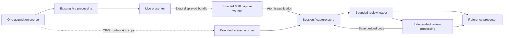

# C-arm capture, reference review and workstation design

**Date:** 2026-09-17

**Status:** Planning baseline drafted at the owner's request. Features are not implemented or accepted. The visual direction is a reviewable proposal, not an approved final screen design.

**Scope:** Extend Lumora's evaluation workstation around the C-arm live/reference workflow. Keep clinical records and device-specific functions in explicit later tracks.

The owner asked to plan the gaps identified against C-arm workstations and update the UI/UX plan with a familiar, attractive interface. This document and the [delivery plan](../plans/2026-09-17-carm-workstation-roadmap.md) make that request concrete. They do not mark earlier milestones accepted, authorize hardware operation, or enable a clinical build. M1–M14 retain their current execution and release gates. New extension work must record its entry conditions at implementation kickoff.

## 1. Product context and selected approach

The intended workflow is an operator watching an imaging source, retaining useful stills or scenes, comparing an earlier image against the continuing live view, and adjusting saved images afterward. Evaluation work uses synthetic sequences, phantoms and test objects. A test session is not a patient examination.

The proposed tone is calm, precise and familiar: dark neutral image surrounds, restrained sage actions, clear text states, large image areas and predictable controls. Preserve Lumora's native Qt Quick frontend and existing processing engine. This is a workstation interface, without decorative dashboards, charts, gradients, glass effects or animated imaging transitions.

Three approaches were considered:

| Approach | Benefit | Cost / decision |
|---|---|---|
| Independent Live and Reference contexts in the current QML shell | Familiar C-arm workflow; shared services; supports one or two monitors | Selected planning direction; requires explicit content, processing and memory ownership |
| Gallery replaces the existing viewer | Smaller initial UI change | Does not meet simultaneous live/reference viewing; suitable only as an explicit small-screen focus fallback |
| Separate review application | Strong process isolation | Duplicates session, export and display coordination; defer unless deployment evidence requires it |

Use established workflow concepts, not a pixel-for-pixel vendor skin. Manufacturer functions and availability vary by device and configuration; this design is not a claim of parity.

## 2. Current foundation and missing behavior

Current source has one active acquisition pipeline, one live presenter, manual presentation Pause, same-frame Original/Enhanced/Compare, processing controls, fullscreen and saved window geometry. Qt Multimedia media inputs produce Mono8 up to 1920×1080; source compatibility and latency require physical acceptance. Basler integration remains M6.

There is no durable capture service, session gallery, independent reference presenter, saved-image processing session, sequence recorder or exposure-event source. `FrameBundle` retains raw, enhanced and display representations in memory; its revision IDs are not a full historical processing recipe. The capture work must bind the complete immutable recipe to the exact bundle being saved, including older paused frames.

Relevant existing seams:

- `src/presentation/src/FramePresenter.cpp`: completed-frame ownership, Pause and renderer receipts.
- `src/qml/QmlWorkstation.cpp`: composition of the current single viewer.
- `src/qml/QuickImageItem.cpp`: rendering and same-frame comparison.
- `src/application/src/ProcessingWorker.cpp`: latest-frame live processing, not a recording queue.
- `src/processing/include/lumora/processing/FrameProcessingEngine.hpp`: reusable pixel processing.
- [M10](../plans/2026-04-25-m10-snapshot-capture.md): exact-frame transactional PNG capture contract.

## 3. Terms and interaction contract

| Term | Meaning |
|---|---|
| Live | Presentation of the active source; receiving video does not establish radiation state |
| Paused | Manual freeze of the Live presentation; acquisition can continue |
| Held image | Image selected through a validated event rule; remains distinct from a disconnected or stale source |
| Capture | A complete, durably published artifact set with identity and provenance |
| Reference | Independently selected saved still or scene used beside Live |
| Lock reference | Prevent automatic replacement by new captures; explicit operator browsing is still allowed |
| Review draft | Unsaved processing settings for one selected saved image |
| Scene | Persisted ordered frames with timestamps, source identity and explicit gaps |
| Test session | Non-patient grouping of captures and scenes |

### Actions

1. **Capture Live** always snapshots the exact completed bundle visible in Live, including when paused. It never follows keyboard focus into Reference. Disable it before the first complete frame, during source-context replacement, or when no safe capture lease is available. Preserve an explicit paused/stale indication in metadata and UI; never call such an image live merely because saving succeeds.
2. Show **Saving…**, then **Saved**, **Save failed**, **Capture busy** or **Save outcome uncertain — checking**. A success thumbnail appears only after verified publication. If a final directory may already exist, reconcile the same capture identity before claiming success or retrying; an uncertain status/catalog row is not a successful thumbnail. Acquisition/rendering must not wait for encoding, directory scanning or disk IO.
3. Successful Capture Live selects its capture in Reference when follow-latest is active. Lock reference prevents automatic following. Selecting any existing thumbnail is an explicit reference change and works while locked.
4. **Pause Live / Resume Live** controls presentation only. Source Stop remains in source controls. Resume Live requests the freshest valid frame and retains truthful waiting/stale feedback.
5. **Save copy** persists a derived version of the selected saved image and its recipe. It does not overwrite Original, rename Capture Live, or change the live recipe. A failed save preserves the draft for retry.
6. Selecting a different image/session with dirty edits offers Save copy, Discard edits or Cancel. Beginning review edits temporarily suspends automatic reference following; an incoming capture cannot discard edits or trigger repeated prompts. Ending edits restores the previous follow/lock policy. Record this temporary state visibly.
7. First delivery pins only persisted captures. An unsaved transient A-to-B transfer is intentionally excluded so a reference never silently masquerades as a saved image.

Capture destination and library browsing are separate state. `captureSessionId` changes only through an explicit New/Use capture session action; `browsingSessionId` changes when opening a past session. Every admitted capture binds its destination before queueing. Browsing another session suspends automatic following and shows the current capture destination in the header; successful captures never switch the browsed session. Return to current session restores browsing/follow eligibility without replaying skipped selections. Save copy belongs to the selected parent capture's session, irrespective of the Live capture destination. Read-only legacy groups remain view-only until a separate import workflow exists. Capture-session changes are rejected during active recording; browsing other sessions remains available under the existing draft and resource guards. Already admitted still jobs retain their original destination.

## 4. Requirements and delivery ownership

| ID | Requirement | Phase |
|---|---|---|
| CARM-01 | Capture the displayed bundle with matching pixels, identity, recipe, orientation and timestamps; report durable result | CR-1 / existing M10 |
| CARM-02 | Persist and reopen bounded non-patient session catalogs and thumbnails; recover complete captures after a crash | CR-1 catalog after M10 |
| CARM-03 | Show independently selected saved content beside Live; lock automatic following; preserve separate zoom/pan | CR-2 |
| CARM-04 | Edit saved images independently, cancel obsolete processing, preserve Original and save derived copies with lineage | CR-3 |
| CARM-05 | Provide familiar, legible, keyboard/touch-accessible QML controls and explicit target/state feedback | CR-1–CR-4 |
| CARM-06 | Persist Live/Reference screen roles, handle DPI and hotplug, and retain a usable one-screen fallback | CR-4 |
| CARM-07 | Record and replay bounded scenes, step/scrub by actual timestamps, expose gaps and extract selected stills | CR-5 |
| CARM-08 | Distinguish live, paused, held, saved, playback, stale and disconnected states on every display | All phases |
| CARM-09 | Optional event hold, retrospective history and input-only pedal actions use validated source-specific semantics | CR-6 |
| CARM-10 | Plan display masks, annotations/measurements, temporal denoise and calibration as individually gated extensions | CR-7 |
| CARM-11 | Plan clinical records, interoperability and clinical release as a separate program | CR-8 |
| CARM-12 | Verify target input, pixel limits, latency, failure recovery and monitor conditions on the actual workstation | Cross-cutting M6/M8/M12/M14 and extension checks |

## 5. Information architecture and visual design

### Default workstation

```text
Lumora   Test session / source summary                 Source settings
EVALUATION — NOT FOR CLINICAL USE
┌────────────────────────┬────────────────────────┬──────────────────┐
│ LIVE / PAUSED           │ REFERENCE · SAVED      │ Adjust Reference │
│ source, time, age       │ capture, time, lock    │ or Adjust Live   │
│                        │                        │                  │
│ large image            │ large image           │ Preset           │
│                        │                        │ Window / level   │
│                        │                        │ Common controls  │
│ fit / 100% / view mode  │ fit / 100% / view mode │ Advanced ▸       │
├────────────────────────┴────────────────────────┴──────────────────┤
│ Capture Live    Pause Live        Reference lock       Save copy   │
│ Saved captures: selected thumbnail, still/scene, time, derived flag │
│ Source state · capture result · storage warning · diagnostics     │
└───────────────────────────────────────────────────────────────────┘
```

Live and Reference default to equal image areas. Explicit thumbnail/open-reference selection starts the inspector on Reference and its heading names that target. Automatic following after Capture Live never silently retargets the inspector. Changing target cancels incomplete numeric entry or slider gestures; committed settings remain in their original context. Existing presets and processing stages are reused, not cloned into a new settings format.

In CR-1, the current single viewer gains Capture Live and truthful save feedback. CR-2 introduces the reference pane and strip; CR-3 enables reference adjustments. Do not show enabled placeholder actions for unimplemented phases. Recording controls ship only with CR-5 acceptance, preserving the present no-Record rule until then.

### Layout rules

- Baseline 1280×800 logical pixels; preferred evaluation layout 1920×1080. Minimum window remains 900×600. At minimum size retain both panes, collapse technical panels and place adjustments in a dismissible nonmodal inspector that leaves critical image states visible.
- If the physical desktop cannot accommodate minimum size, offer an explicit single-pane focus layout with a permanent hidden-Live state strip and a one-action return. Browsing never silently hides Live or changes acquisition.
- Filmstrip has bounded lazy loading, explicit selected/derived/scene states and keyboard previous/next. A large collection must not decode all full-resolution images.
- No whole-image crossfades, transitions that obscure changing anatomy, automatic zoom, or movement of the Capture Live control when state changes. Use only brief non-image feedback, respecting reduced motion.
- Text plus shape/icon conveys state. Sage identifies the primary capture/selection action; amber identifies held/paused or attention states; red denotes failures. Color alone is insufficient, and Live green never implies X-rays off/on.
- Retain the current charcoal/olive palette as the draft. Use a legible installed sans-serif, preferably Noto Sans on Linux and Segoe UI on Windows, with explicit fallback. Typical body/action text 14–16 logical pixels; essential labels no smaller than 12. Tabular digits for timestamps.
- General control targets at least 36 logical pixels with an explicit touch density of at least 44. Meet measured text contrast targets of 4.5:1 and control/focus contrast of 3:1 in the implemented palette; the concept is not evidence of those measurements.
- Keep critical evaluation, orientation, source loss and frame-state information visible with panels collapsed, in fullscreen and on detached windows. Window titles include their Live or Reference role.

### Two monitors

Use one application and one acquisition pipeline. Assign windows by role through display settings, retaining readable role previews and an explicit Apply action. Restore roles only when the saved display identity remains usable; otherwise reopen in a known visible position on the primary screen. Disconnecting either screen returns to the single-window layout without discarding reference selection, processing drafts, recording state or source status. Never restart acquisition merely to rearrange windows.

## 6. Data and processing boundaries



The live presenter remains authoritative for what Capture Live selects. Capture identity and frame-bound provenance are immutable through queueing. Preserve M10 native Original samples, native enhanced U16, oriented screen-equivalent preview and transactional publication. The four accepted storage jobs include the active encoder. Do not replace this with a screenshot API.

Session/capture manifests are the durable source of truth; an index is reconstructible. Readers validate schema versions, artifact names, dimensions, pixel representation and path containment before decoding. Corrupt, missing or incomplete entries remain distinct from successful saves. No automatic deletion or retention policy is introduced by these phases. Explicit deletion can be specified later; it must never remove a referenced parent silently.

For the first delivery, Saved/committed means the complete transaction is closed and atomically published, recoverable after application-process failure under the supported filesystem contract. It is not a tested power-loss or storage-hardware-loss guarantee. The storage adapter must document file synchronization and metadata publication barriers per supported Windows/Linux filesystem, propagate sync failures, and separately qualify any stronger power-loss claim. Apply the same contract to session manifests and reserved ID ranges; final publication must never replace an existing capture, and startup reconciles the next ID against committed manifests rather than trusting a potentially stale counter alone.

Rename is the publication boundary. A failure known to occur before it can abort the owned partial directory; an uncertain rename outcome or subsequent barrier failure produces `CommitIndeterminate`, preserving the key/path and all possible final artifacts. Reconcile that same transaction off-thread and expose its verified-on-reopen or unresolved state without silent duplication. Save copy keeps its dirty draft and navigation guard until positive matching reconciliation. Later edits/commands invalidate old continuations; Cancel never deletes a possibly published copy. Capture admission reserves bounded terminal-result capacity as well as one of four retained storage jobs.

Review decoded images, processing scratch, renderer textures, thumbnails, recorder buffers and live pools have separate measured limits. Do not retain acquisition pool leases for a gallery selection. Admit resources before increasing viewer count or enabling recording. Limit active review work to the selected object plus bounded prefetch; coalesce slider edits and reject stale completion by selection ID and recipe revision. A review OOM/decoder failure leaves Live running and the last complete reference identifiable.

Live enhancement remains part of the existing acquisition-to-display pipeline. Adjust Live changes that pipeline; Adjust Reference changes only the selected saved image's draft. Independent workers and memory budgets do not isolate CPU or memory bandwidth. The initial review engine uses the existing `ProcessingPreparationOptions::cpuExecutionSlots = 1`; keep one active request plus one replaceable latest request, and defer/throttle new review work when the measured concurrent workload exceeds its agreed Live regression budget. Retain the last complete Reference with visible pending feedback. Never silently disable Live stages, change its recipe or lower the source FPS to accommodate review. This is a scheduling/admission policy, not a guarantee of preempting an in-flight processing stage. Benchmark Live alone and with review, still encoding and recording; failure to meet the agreed budget limits the admitted concurrent profile.

Capture-held old live contexts count toward the one-old-plus-one-candidate context limit through an explicit generation-scoped application retention registry. Renderer acknowledgement remains independent so the new Live context can bind and start while an old save finishes. Defer/reject further resource replacement while a retained capture prevents retirement; never accumulate one full pool set per pending save. Review bundles pinned by Save copy remain charged to the review budget until the writer releases them. The current/replacement pair limit does not erase these storage leases; reject a new edit/save that cannot fit while keeping the current view usable.

Review stores a source capture ID, a recipe revision, view state and derived-copy lineage. Geometry operations in these phases are view transforms only. Existing installation orientation remains administrator-managed and source-specific; arbitrary image rotation/flip and calibrated measurement are not smuggled into the new editor. If later review transforms are introduced, record them as separate review provenance.

Original/Processed/Both modes produce different available artifacts. A Processed-only capture must reopen honestly without fabricating missing raw samples or forcing it into the live `FrameBundle` invariant. Use the capture/review plan's `ReviewImageSet` and presentation-only image envelope to expose available planes. Source-dependent reprocessing requires stored Original; otherwise show viewing-only controls with a clear reason. A successful Save copy becomes the clean selected derived capture only if selection and draft revision still match the submitted save. Otherwise publish the saved copy in the gallery and preserve the newer selection/draft.

## 7. Scene and event boundaries

CR-5 begins with manual bounded recording; Live remains newest-frame oriented while recording has its own explicit completeness policy. Never record by polling the live presenter or latest-value slot, which intentionally drops intermediate frames. Preserve acquired frame identities and actual timestamps. Retained Original sequence depth is the input depth, not fabricated detector depth. Display-video export is a later derivative with a clear lossy/display label.

**Owner decision, 2026-09-17:** Record original incoming frames plus processing settings. Persist the initial recipe and subsequent revisions with their defined source-time/frame association. These incoming frames may already contain processing or overlays from the C-arm's video output; Original means the pixels Lumora received. This choice preserves later reprocessing and does not promise a recording identical to the enhanced Live display. Live enhancement continues during recording.

Pause Live and reference playback do not stop recording. Source changes/reconfiguration are rejected while recording until an explicit Stop recording completes. Disconnect/fault ends the current run with an incomplete/gap result; no success claim for unwritten frames. Last-scene hold and retrospective pre-event capture require a separately admitted history budget and event contract in CR-6.

**Save selected frame** is a separate Reference action in CR-5. It captures the acknowledged recorded frame's original incoming pixels, timestamp and scene/frame lineage into the scene's session. Bind that identity at admission even if playback or scrubbing continues; do not fall back to Live or a newer decoded frame. It leaves the current scene/transport unchanged and adds the verified still to the parent session's catalog. Enhanced derivatives use a separately identified review recipe through Save copy.

CR-6 separates three inputs: keyboard/pedal UI actions, device exposure events, and optional image-derived event estimation. Only the first can be specified without the target device protocol. Radiation state is Unknown unless supported by a validated device signal; a static image, dark frame, paused viewer or dead stream cannot establish exposure completion. A future estimator must be labelled as estimated and cannot replace a device radiation indicator or safety interlock.

## 8. Later feature tracks

| Track | First useful deliverable | Required evidence before implementation/release |
|---|---|---|
| Display mask / virtual shutters | Non-destructive display-only circular mask with reset and recorded preview geometry | Alignment under pan/zoom, Original preservation; never claim physical collimation or dose reduction |
| Annotation and measurement | Image-bound notes/markers, then distances/angles for calibrated test objects | Separate scope amendment to current v1 exclusions; calibration method, units, magnification and invalidation rules; otherwise pixels only |
| Temporal denoise | Bounded enhanced-path history, motion test sequences and clear strength controls | Motion/ghosting and lag characterization; history reset on source/settings changes; repeated held frames do not count as new samples |
| Dark/flat-field correction | Matched reference acquisition and validation wizard for an appropriate raw source | Camera/settings match, reference version and invalidation; processed video may be unsuitable |
| Subtraction / vascular roadmap | Separately specified mask/run alignment workflow if vascular use is selected | Target procedure, motion/registration behavior, source performance and validation; not a generic enhancement toggle |
| Clinical workflow | Patient → study → series → instance model; worklist and DICOM/PACS export/import planning | Intended use, data/security/identity policy, DICOM conformance scope, receiving systems and separate clinical program |
| Clinical operation | Roles, audit trail, privacy, backup/recovery, dose metadata where available and validated display setup | Existing clinical-release gate; qualified review and explicit release authorization |

These tracks are planned discovery/decision work, not hidden requirements for CR-1–CR-4. They preserve current PRD exclusions until amended at their own entry gate.

## 9. Verification and operator evaluation

Automated coverage must establish pixel/recipe/ID agreement, queue limits, crash recovery, independent view state, stale-result rejection, recording gaps, input debouncing and screen-loss recovery. Use existing Linux/GCC and Windows/MSVC Debug/Release presets, native QML scene tests and relevant allocation/performance evidence. Test slow/full/unwritable storage and resource rejection while Live continues. Report acquired, processed, displayed and recorded rates separately.

Usability sessions use representative trained operators with synthetic/test-object material. Tasks: capture a moving marker at the displayed instant; lock a reference and capture again; find an earlier frame; edit/save a reference without changing Live; resume from Pause; recognize a lost source; review a scene; recover a detached display. Any wrong-target capture/edit, missed stale state or mistaken save-success is a release-blocking usability finding for the affected phase. Record task success, time, misclicks and corrective actions; set numeric timing targets from the baseline session rather than inventing a universal target.

Hardware acceptance records exact C-arm/source/capture device, output signal, mode, bit depth, FPS, driver/OS, workstation and monitor/DPI conditions. Verify aspect ratio, crops/burned-in overlays, frame pacing, latency, orientation and source-loss behavior. Preserve M6/M8/M12/M14 gates; Linux synthetic RTSP evidence is not physical Windows acceptance.

## 10. Decisions still requiring external input

| Decision | Current planning default | Must resolve before |
|---|---|---|
| Target C-arm and connection | Owner confirmed not decided on 2026-09-17; validate one identified device/output/capture path first, using existing adapters where compatible | Device-specific adapter work / physical acceptance |
| Final visual preference | Modern dark Lumora palette and familiar live/reference workflow | UI implementation kickoff after owner review of this proposal |
| Typical monitor arrangement | Single-display split plus optional separate Live/Reference displays | CR-4 hardware/DPI acceptance |
| Clinical procedure priorities | General still/reference review first; vascular functions deferred | Subtraction/roadmap specification |
| Exposure signal / pedal protocol | Unknown; manual capture/hold only initially | CR-6 device integration |
| Recording profile | Owner selected original incoming frames + settings; duration, frame/byte limits and supported concurrent workload remain benchmark decisions | CR-5 production controls |

## 11. Reference basis

Reviewed 2026-09-17. These sources inform workflow concepts, not Lumora validation or exact vendor UI reproduction.

- [Siemens Cios Flow hardware overview](https://academy.siemens-healthineers.com/_/en-us/cios-flow-hardware-overview-online-training/): separate live/reference display roles and image/scene storage controls.
- [Siemens Cios Flow software overview](https://academy.siemens-healthineers.com/_/en-us/cios-flow-software-overview-online-training/): reference hold, postprocessing and scene review; some functions are optional.
- [GE OEC One](https://www.gehealthcare.com/en-gb/products/surgical-imaging/oec-one): live and reference images can share one large display.
- [GE OEC One CFD brochure](https://landing1.gehealthcare.com/rs/005-SHS-767/images/OEC-One-CFD-Brochure-2021.pdf): FluoroStore recall and extracting a previous frame.
- [Siemens Cios Fusion measurements and annotations](https://academy.siemens-healthineers.com/_/en-us/cios-fusion-measurements-and-annotations-job-aid/): separate measurement workflow inspiration.

The [earlier M2 ideas](../../ideas/2026-09-10-m2-inspired-features.md) and [UI ideas](../../ideas/2026-09-12-workstation-ui-enhancements.md) remain historical inspiration. Their selected capture/review ideas are now tracked here; they are not duplicate implementations.
